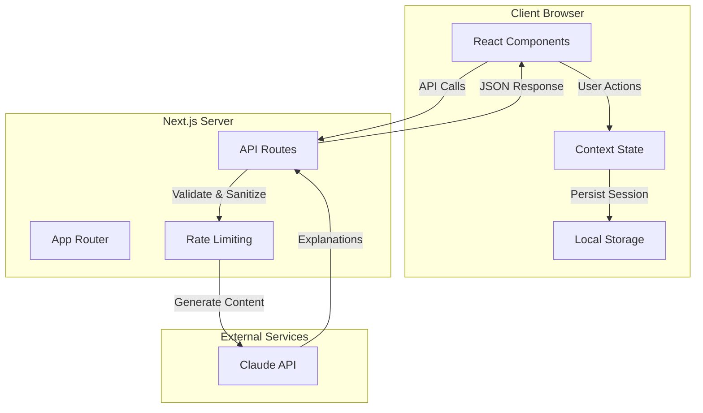
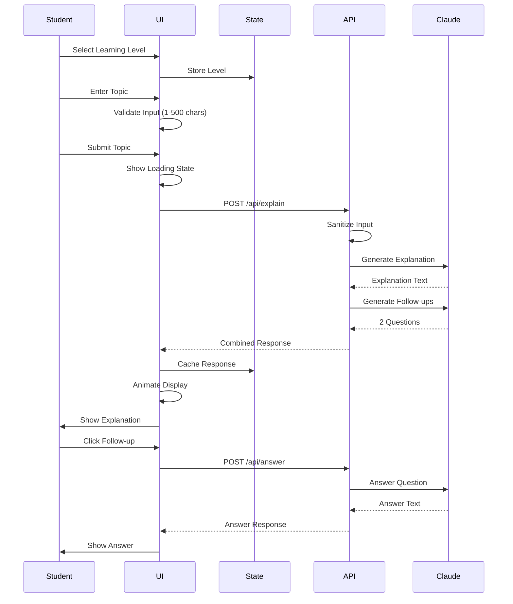
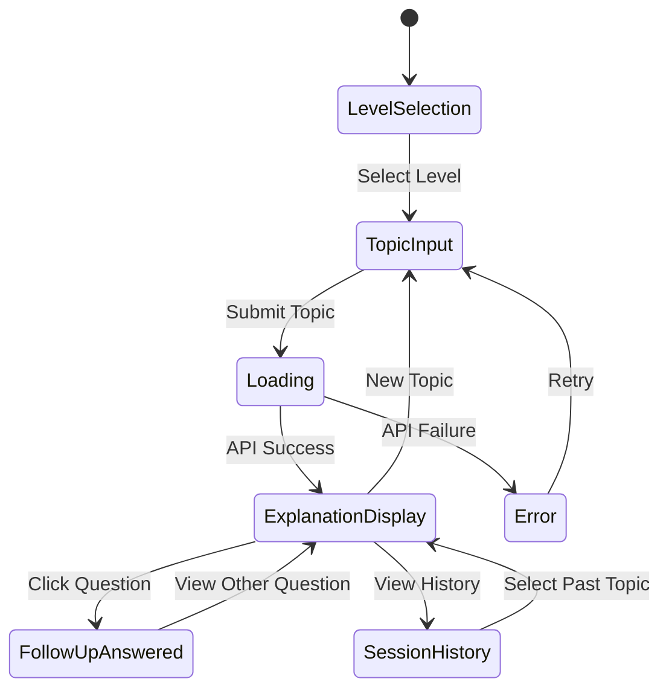

# Design Document: ClassMate.info

## Overview

ClassMate.info is a Next.js 14+ web application that provides AI-powered educational explanations with a nostalgic school-themed interface. The application creates an emotionally warm learning environment by evoking universal school memories through carefully crafted visual design, micro-interactions, and thoughtful UX patterns.

### Core Design Principles

1. **Nostalgic Warmth**: Every interaction should evoke positive school memories through visual design, sounds, and animations
2. **Global Accessibility**: Design for students worldwide with culturally neutral patterns and universal school experiences
3. **Age-Appropriate Simplicity**: Interface complexity matches the cognitive abilities of 9-14 year olds
4. **Mobile-First Responsiveness**: Prioritize mobile experience while maintaining desktop excellence
5. **Performance-Conscious**: Fast, responsive interactions that don't interrupt learning flow
6. **Accessibility by Default**: WCAG 2.1 AA compliance integrated into every component

### Technology Stack

- **Framework**: Next.js 14+ with App Router
- **Language**: TypeScript (strict mode)
- **Styling**: Tailwind CSS with custom nostalgic design tokens
- **AI Integration**: Anthropic Claude API (via server-side API routes)
- **State Management**: React Context + Local Storage for session persistence
- **Fonts**: Lora (serif, body text), DM Sans (sans-serif, UI elements)
- **Animation**: Framer Motion for micro-interactions
- **Audio**: Web Audio API for optional sound effects

## Architecture

### High-Level System Architecture



### Application Flow



## Components and Interfaces

### Component Hierarchy

```
App (Root Layout)
├── NostalgicThemeProvider
├── SessionProvider
├── SoundProvider
└── Page Components
    ├── HomePage
    │   ├── LevelSelector
    │   │   ├── LevelCard (x6)
    │   │   └── ChalkboardBackground
    │   ├── TopicInput
    │   │   ├── NotebookTextarea
    │   │   ├── CharacterCounter
    │   │   └── SubmitButton
    │   ├── ExplanationDisplay
    │   │   ├── ChalkboardSection
    │   │   ├── TypewriterText
    │   │   └── FollowUpQuestions
    │   │       └── QuestionCard (x2)
    │   └── SessionHistory
    │       └── HistoryTab (x10 max)
    └── ErrorBoundary
        └── FriendlyErrorDisplay
```

### Core Component Specifications

#### 1. LevelSelector Component

**Purpose**: Allow students to choose their learning level (ages 9-14)

**Props**:
```typescript
interface LevelSelectorProps {
  onLevelSelect: (level: LearningLevel) => void;
  selectedLevel?: LearningLevel;
}

type LearningLevel = 1 | 2 | 3 | 4 | 5 | 6;
```

**Visual Design**:
- 6 cards arranged in 2 rows (mobile) or 3 columns (desktop)
- Each card shows age range and simple icon
- Chalkboard texture background
- Chalk-style text rendering
- Hover effect: subtle lift + chalk dust particles

**Interaction**:
- Click/tap to select
- Visual feedback within 50ms
- Smooth transition to topic input
- Optional school bell sound on selection

#### 2. TopicInput Component

**Purpose**: Accept student's topic query with nostalgic notebook styling

**Props**:
```typescript
interface TopicInputProps {
  onSubmit: (topic: string) => void;
  isLoading: boolean;
  maxLength: number; // 500
}
```

**Visual Design**:
- Notebook paper texture background
- Ruled lines (subtle gray)
- Handwriting-style placeholder: "What would you like to learn about today?"
- Character counter in bottom-right (like page numbers)
- Submit button styled as vintage school button

**Validation**:
- Real-time character count
- Enable submit only when 1-500 characters
- Show friendly error for empty submission
- Sanitize input before API call

#### 3. ExplanationDisplay Component

**Purpose**: Present AI-generated explanation with chalkboard aesthetic

**Props**:
```typescript
interface ExplanationDisplayProps {
  explanation: string;
  topic: string;
  level: LearningLevel;
  followUpQuestions: FollowUpQuestion[];
  onQuestionClick: (questionId: string) => void;
}

interface FollowUpQuestion {
  id: string;
  question: string;
  answer?: string;
}
```

**Visual Design**:
- Dark chalkboard background (#1a1a1a)
- White/cream chalk text (#f5f5dc)
- Typewriter animation for text appearance
- Lora serif font for readability
- Subtle chalk texture overlay

**Animation**:
- Text appears character-by-character (typewriter effect)
- Speed: 30ms per character
- Can be skipped by clicking
- Respects prefers-reduced-motion

#### 4. FollowUpQuestions Component

**Purpose**: Display interactive follow-up questions

**Visual Design**:
- 2 question cards side-by-side (desktop) or stacked (mobile)
- Raised hand icon (✋) in chalk style
- Question mark decoration
- Hover: slight rotation + scale
- Clicked state: expand to show answer

**Interaction Pattern**:
- Click question → API call → animate answer reveal
- Answer appears below question with fade-in
- Other question remains clickable
- Smooth accordion-style expansion

### Shared UI Components

#### ChalkboardBackground
- Reusable dark background with chalk texture
- Subtle noise overlay for authenticity
- CSS: `background-image: url('/textures/chalkboard.png')`

#### NotebookPaper
- Reusable light background with ruled lines
- Paper texture overlay
- Margin line on left (red vertical line)

#### LoadingSpinner
- Themed loading states:
  - Chalk writing animation
  - Notebook page flip
  - School bell swinging
- Displayed during API calls

#### FriendlyError
- Age-appropriate error messages
- Nostalgic styling (torn paper note aesthetic)
- Retry button
- Themed messages:
  - API error: "The teacher stepped out for a moment..."
  - Network error: "Can't reach the classroom right now..."
  - Rate limit: "The classroom is full, try again soon..."


## Data Models

### TypeScript Interfaces

```typescript
// Core domain models
interface LearningSession {
  id: string;
  level: LearningLevel;
  topics: TopicEntry[];
  createdAt: Date;
  settings: UserSettings;
}

interface TopicEntry {
  id: string;
  topic: string;
  explanation: string;
  followUpQuestions: FollowUpQuestion[];
  timestamp: Date;
  level: LearningLevel;
}

interface FollowUpQuestion {
  id: string;
  question: string;
  answer?: string;
  isAnswered: boolean;
}

interface UserSettings {
  soundEnabled: boolean;
  animationsEnabled: boolean;
  reducedMotion: boolean;
}

type LearningLevel = 1 | 2 | 3 | 4 | 5 | 6;

// API request/response models
interface ExplainRequest {
  topic: string;
  level: LearningLevel;
}

interface ExplainResponse {
  explanation: string;
  followUpQuestions: FollowUpQuestion[];
  error?: string;
}

interface AnswerRequest {
  question: string;
  context: string; // Original topic + explanation
  level: LearningLevel;
}

interface AnswerResponse {
  answer: string;
  error?: string;
}

// Claude API models
interface ClaudeRequest {
  model: string;
  max_tokens: number;
  messages: ClaudeMessage[];
  system?: string;
}

interface ClaudeMessage {
  role: 'user' | 'assistant';
  content: string;
}

interface ClaudeResponse {
  id: string;
  content: ClaudeContent[];
  model: string;
  stop_reason: string;
}

interface ClaudeContent {
  type: 'text';
  text: string;
}
```

### Local Storage Schema

```typescript
// Key: 'classmate_session'
interface StoredSession {
  version: '1.0';
  level?: LearningLevel;
  topics: TopicEntry[];
  settings: UserSettings;
  lastUpdated: string; // ISO date
}

// Key: 'classmate_settings'
interface StoredSettings {
  soundEnabled: boolean;
  animationsEnabled: boolean;
  theme: 'default'; // Future: support themes
}
```

### API Route Specifications

#### POST /api/explain

**Purpose**: Generate age-appropriate explanation for a topic

**Request Body**:
```json
{
  "topic": "Why is the sky blue?",
  "level": 3
}
```

**Response**:
```json
{
  "explanation": "The sky appears blue because...",
  "followUpQuestions": [
    {
      "id": "fq_1",
      "question": "What would happen if Earth had no atmosphere?",
      "isAnswered": false
    },
    {
      "id": "fq_2",
      "question": "Why does the sky change colors at sunset?",
      "isAnswered": false
    }
  ]
}
```

**Error Response**:
```json
{
  "error": "Unable to generate explanation",
  "code": "CLAUDE_API_ERROR",
  "message": "The teacher stepped out for a moment. Please try again!"
}
```

**Validation**:
- Topic: 1-500 characters, sanitized
- Level: Must be 1-6
- Rate limit: 10 requests per minute per IP

**Claude Prompt Template**:
```
You are a patient, encouraging teacher explaining concepts to a {age}-year-old student.

Topic: {topic}

Provide a clear, engaging explanation using:
- Simple, age-appropriate language
- Culturally universal examples
- Encouraging tone
- 2-3 paragraphs maximum
- No jargon unless explained

Keep the explanation under 400 words.
```

#### POST /api/answer

**Purpose**: Answer a follow-up question with context

**Request Body**:
```json
{
  "question": "What would happen if Earth had no atmosphere?",
  "context": "Original topic: Why is the sky blue?\n\nExplanation: The sky appears blue because...",
  "level": 3
}
```

**Response**:
```json
{
  "answer": "If Earth had no atmosphere, the sky would appear black..."
}
```

**Claude Prompt Template**:
```
You are a patient teacher answering a follow-up question for a {age}-year-old student.

Original Context:
{context}

Follow-up Question: {question}

Provide a clear, concise answer that:
- Builds on the previous explanation
- Uses simple language
- Encourages further curiosity
- Stays under 200 words
```

#### GET /api/health

**Purpose**: Health check for monitoring

**Response**:
```json
{
  "status": "healthy",
  "timestamp": "2024-01-15T10:30:00Z",
  "claudeApiStatus": "connected"
}
```

## Visual Design System

### Color Palette

```css
/* Primary Colors - Nostalgic School Theme */
--chalk-white: #f5f5dc;      /* Cream white, like chalk */
--chalkboard-black: #1a1a1a; /* Deep black, chalkboard */
--chalk-gray: #9ca3af;        /* Dusty gray, faded chalk */
--paper-white: #fefefe;       /* Clean paper white */
--paper-cream: #faf8f3;       /* Aged paper cream */
--ink-black: #2d3748;         /* Ink black for text */
--ruled-line: #e5e7eb;        /* Subtle ruled lines */
--margin-red: #dc2626;        /* Classic margin line red */

/* Accent Colors - Subtle and Warm */
--accent-gold: #f59e0b;       /* Gold star, achievement */
--accent-blue: #3b82f6;       /* Notebook blue */
--accent-green: #10b981;      /* Encouraging green */

/* Semantic Colors */
--error-red: #ef4444;
--warning-yellow: #fbbf24;
--success-green: #10b981;

/* Opacity Variants */
--chalk-dust: rgba(245, 245, 220, 0.1);
--shadow-soft: rgba(0, 0, 0, 0.1);
```

### Typography

```css
/* Font Families */
--font-body: 'Lora', serif;        /* Explanations, content */
--font-ui: 'DM Sans', sans-serif;  /* Buttons, labels, UI */

/* Font Sizes - Mobile First */
--text-xs: 0.75rem;    /* 12px - labels */
--text-sm: 0.875rem;   /* 14px - secondary */
--text-base: 1rem;     /* 16px - body */
--text-lg: 1.125rem;   /* 18px - emphasis */
--text-xl: 1.25rem;    /* 20px - headings */
--text-2xl: 1.5rem;    /* 24px - page titles */
--text-3xl: 1.875rem;  /* 30px - hero */

/* Line Heights */
--leading-tight: 1.25;
--leading-normal: 1.5;
--leading-relaxed: 1.75;

/* Font Weights */
--font-normal: 400;
--font-medium: 500;
--font-semibold: 600;
--font-bold: 700;
```

### Spacing System

```css
/* Tailwind-compatible spacing scale */
--space-1: 0.25rem;   /* 4px */
--space-2: 0.5rem;    /* 8px */
--space-3: 0.75rem;   /* 12px */
--space-4: 1rem;      /* 16px */
--space-5: 1.25rem;   /* 20px */
--space-6: 1.5rem;    /* 24px */
--space-8: 2rem;      /* 32px */
--space-10: 2.5rem;   /* 40px */
--space-12: 3rem;     /* 48px */
--space-16: 4rem;     /* 64px */
```

### Border Radius

```css
--radius-sm: 0.25rem;   /* 4px - subtle */
--radius-md: 0.5rem;    /* 8px - cards */
--radius-lg: 0.75rem;   /* 12px - modals */
--radius-xl: 1rem;      /* 16px - hero elements */
--radius-full: 9999px;  /* Circular */
```

### Shadows

```css
/* Soft, nostalgic shadows */
--shadow-sm: 0 1px 2px 0 rgba(0, 0, 0, 0.05);
--shadow-md: 0 4px 6px -1px rgba(0, 0, 0, 0.1);
--shadow-lg: 0 10px 15px -3px rgba(0, 0, 0, 0.1);
--shadow-chalk: 0 2px 8px rgba(245, 245, 220, 0.2);
--shadow-paper: 0 4px 12px rgba(0, 0, 0, 0.08);
```

### Nostalgic Design Elements

#### Chalkboard Texture
```css
.chalkboard {
  background-color: var(--chalkboard-black);
  background-image: 
    url('/textures/chalkboard-noise.png'),
    linear-gradient(180deg, #1a1a1a 0%, #0f0f0f 100%);
  background-blend-mode: overlay;
  position: relative;
}

.chalkboard::before {
  content: '';
  position: absolute;
  inset: 0;
  background: radial-gradient(
    circle at 30% 40%,
    rgba(255, 255, 255, 0.03) 0%,
    transparent 60%
  );
  pointer-events: none;
}
```

#### Notebook Paper
```css
.notebook-paper {
  background-color: var(--paper-cream);
  background-image: 
    repeating-linear-gradient(
      transparent,
      transparent 31px,
      var(--ruled-line) 31px,
      var(--ruled-line) 32px
    ),
    linear-gradient(
      90deg,
      var(--margin-red) 0px,
      var(--margin-red) 2px,
      transparent 2px,
      transparent 60px
    );
  padding-left: 70px; /* Space for margin */
}
```

#### Chalk Text Effect
```css
.chalk-text {
  color: var(--chalk-white);
  font-family: var(--font-body);
  text-shadow: 
    0 1px 2px rgba(0, 0, 0, 0.3),
    0 0 8px rgba(245, 245, 220, 0.4);
  letter-spacing: 0.02em;
}
```

### Component-Specific Styles

#### Level Card
```css
.level-card {
  background: var(--chalkboard-black);
  border: 2px solid var(--chalk-gray);
  border-radius: var(--radius-lg);
  padding: var(--space-6);
  transition: all 0.2s ease;
  cursor: pointer;
}

.level-card:hover {
  transform: translateY(-4px);
  box-shadow: var(--shadow-chalk);
  border-color: var(--chalk-white);
}

.level-card.selected {
  border-color: var(--accent-gold);
  background: linear-gradient(135deg, #1a1a1a 0%, #2d2d2d 100%);
}
```

#### Submit Button
```css
.submit-button {
  background: var(--ink-black);
  color: var(--paper-white);
  font-family: var(--font-ui);
  font-weight: var(--font-semibold);
  padding: var(--space-3) var(--space-6);
  border-radius: var(--radius-md);
  border: 2px solid var(--ink-black);
  transition: all 0.15s ease;
  box-shadow: var(--shadow-md);
}

.submit-button:hover:not(:disabled) {
  background: var(--paper-white);
  color: var(--ink-black);
  transform: translateY(-2px);
  box-shadow: var(--shadow-lg);
}

.submit-button:disabled {
  opacity: 0.5;
  cursor: not-allowed;
}
```


## Animation and Micro-Interaction Specifications

### Animation Principles

1. **Purposeful**: Every animation serves a functional purpose (feedback, guidance, delight)
2. **Subtle**: Animations enhance without distracting from learning
3. **Performant**: Use CSS transforms and opacity for 60fps performance
4. **Respectful**: Honor prefers-reduced-motion preferences
5. **Nostalgic**: Evoke school memories (chalk writing, page turning, bell ringing)

### Core Animations

#### 1. Typewriter Effect (Explanation Display)

**Purpose**: Simulate chalk writing on chalkboard

**Implementation**:
```typescript
// Framer Motion variant
const typewriterVariants = {
  hidden: { opacity: 0 },
  visible: (i: number) => ({
    opacity: 1,
    transition: {
      delay: i * 0.03, // 30ms per character
      duration: 0.05
    }
  })
};

// Respects reduced motion
const shouldAnimate = !window.matchMedia('(prefers-reduced-motion: reduce)').matches;
```

**Behavior**:
- Characters appear sequentially
- Speed: 30ms per character
- Can be skipped by clicking anywhere
- Reduced motion: instant display

#### 2. Page Transition (Notebook Flip)

**Purpose**: Simulate turning notebook pages between states

**Implementation**:
```css
@keyframes page-flip {
  0% {
    transform: perspective(1000px) rotateY(0deg);
    opacity: 1;
  }
  50% {
    transform: perspective(1000px) rotateY(90deg);
    opacity: 0.5;
  }
  100% {
    transform: perspective(1000px) rotateY(0deg);
    opacity: 1;
  }
}

.page-transition {
  animation: page-flip 0.6s ease-in-out;
}
```

**Trigger**: When navigating between level selection and topic input

#### 3. Chalk Dust Particles

**Purpose**: Add whimsical feedback on interactions

**Implementation**:
```typescript
// Canvas-based particle system
interface Particle {
  x: number;
  y: number;
  vx: number;
  vy: number;
  life: number;
  size: number;
}

function createChalkDust(x: number, y: number): Particle[] {
  return Array.from({ length: 8 }, () => ({
    x,
    y,
    vx: (Math.random() - 0.5) * 2,
    vy: (Math.random() - 0.5) * 2,
    life: 1,
    size: Math.random() * 3 + 1
  }));
}
```

**Trigger**: On level card hover, button clicks

#### 4. Loading States

**Chalk Writing Spinner**:
```css
@keyframes chalk-write {
  0% {
    stroke-dashoffset: 100;
  }
  100% {
    stroke-dashoffset: 0;
  }
}

.chalk-spinner {
  stroke: var(--chalk-white);
  stroke-width: 3;
  stroke-dasharray: 100;
  animation: chalk-write 1.5s ease-in-out infinite;
}
```

**Paper Flip Loader**:
```css
@keyframes paper-flip {
  0%, 100% {
    transform: rotateY(0deg);
  }
  50% {
    transform: rotateY(180deg);
  }
}

.paper-loader {
  animation: paper-flip 1.2s ease-in-out infinite;
}
```

#### 5. Follow-Up Question Reveal

**Purpose**: Smooth expansion when question is clicked

**Implementation**:
```typescript
const questionVariants = {
  collapsed: {
    height: 'auto',
    opacity: 1
  },
  expanded: {
    height: 'auto',
    opacity: 1,
    transition: {
      height: { duration: 0.3, ease: 'easeOut' },
      opacity: { duration: 0.2 }
    }
  }
};
```

**Behavior**:
- Click question → rotate icon 180°
- Expand card with smooth height transition
- Fade in answer text
- Slight scale effect (1.02x) on hover

#### 6. Success Celebration

**Purpose**: Encourage students after completing a session

**Implementation**:
```typescript
// Confetti-style animation with school-themed elements
const celebrationElements = ['⭐', '📚', '✏️', '🎓'];

function triggerCelebration() {
  // Create floating elements
  // Fade out after 2 seconds
  // Play optional bell sound
}
```

**Trigger**: After viewing both follow-up questions

### Sound Effects

#### Sound Library

```typescript
interface SoundEffect {
  id: string;
  src: string;
  volume: number;
  category: 'feedback' | 'transition' | 'celebration';
}

const sounds: SoundEffect[] = [
  {
    id: 'bell-soft',
    src: '/sounds/school-bell-soft.mp3',
    volume: 0.3,
    category: 'feedback'
  },
  {
    id: 'page-turn',
    src: '/sounds/page-turn.mp3',
    volume: 0.2,
    category: 'transition'
  },
  {
    id: 'chalk-tap',
    src: '/sounds/chalk-tap.mp3',
    volume: 0.15,
    category: 'feedback'
  },
  {
    id: 'success-chime',
    src: '/sounds/success-chime.mp3',
    volume: 0.25,
    category: 'celebration'
  }
];
```

#### Sound Manager

```typescript
class SoundManager {
  private sounds: Map<string, HTMLAudioElement>;
  private enabled: boolean;

  constructor() {
    this.sounds = new Map();
    this.enabled = true;
    this.preloadSounds();
  }

  play(soundId: string): void {
    if (!this.enabled) return;
    
    const sound = this.sounds.get(soundId);
    if (sound) {
      sound.currentTime = 0;
      sound.play().catch(() => {
        // Handle autoplay restrictions
      });
    }
  }

  toggle(): void {
    this.enabled = !this.enabled;
  }
}
```

**Trigger Points**:
- Level selection: `bell-soft`
- Topic submission: `chalk-tap`
- Page transition: `page-turn`
- Session completion: `success-chime`

### Haptic Feedback (Mobile)

```typescript
function triggerHaptic(type: 'light' | 'medium' | 'heavy' = 'light'): void {
  if ('vibrate' in navigator) {
    const patterns = {
      light: [10],
      medium: [20],
      heavy: [30]
    };
    navigator.vibrate(patterns[type]);
  }
}
```

**Trigger Points**:
- Button press: `light`
- Level selection: `medium`
- Error state: `heavy` (pattern: [50, 100, 50])

### Responsive Animation Adjustments

```typescript
// Reduce animation complexity on mobile for performance
const isMobile = window.innerWidth < 768;

const animationConfig = {
  typewriterSpeed: isMobile ? 20 : 30, // Faster on mobile
  particleCount: isMobile ? 4 : 8,     // Fewer particles
  transitionDuration: isMobile ? 0.3 : 0.5
};
```

### Accessibility Considerations

```typescript
// Check user preferences
const prefersReducedMotion = window.matchMedia(
  '(prefers-reduced-motion: reduce)'
).matches;

// Disable animations if preferred
if (prefersReducedMotion) {
  // Instant transitions
  // No particle effects
  // No typewriter effect
  // Keep only essential feedback animations
}
```

## State Management

### Context Architecture

```typescript
// Session Context - Manages learning session state
interface SessionContextValue {
  level: LearningLevel | null;
  currentTopic: TopicEntry | null;
  history: TopicEntry[];
  setLevel: (level: LearningLevel) => void;
  submitTopic: (topic: string) => Promise<void>;
  answerFollowUp: (questionId: string) => Promise<void>;
  clearSession: () => void;
  isLoading: boolean;
  error: string | null;
}

// Settings Context - User preferences
interface SettingsContextValue {
  soundEnabled: boolean;
  animationsEnabled: boolean;
  toggleSound: () => void;
  toggleAnimations: () => void;
}

// Theme Context - Nostalgic theme state
interface ThemeContextValue {
  theme: 'default';
  textures: {
    chalkboard: string;
    notebook: string;
  };
}
```

### State Flow Diagram



### Local Storage Persistence

```typescript
// Save session to local storage
function persistSession(session: LearningSession): void {
  const stored: StoredSession = {
    version: '1.0',
    level: session.level,
    topics: session.topics.slice(-10), // Keep last 10
    settings: session.settings,
    lastUpdated: new Date().toISOString()
  };
  
  localStorage.setItem('classmate_session', JSON.stringify(stored));
}

// Load session from local storage
function loadSession(): LearningSession | null {
  const stored = localStorage.getItem('classmate_session');
  if (!stored) return null;
  
  try {
    const parsed: StoredSession = JSON.parse(stored);
    
    // Validate version
    if (parsed.version !== '1.0') return null;
    
    return {
      id: crypto.randomUUID(),
      level: parsed.level || null,
      topics: parsed.topics || [],
      createdAt: new Date(),
      settings: parsed.settings
    };
  } catch {
    return null;
  }
}

// Clear session on browser close
window.addEventListener('beforeunload', () => {
  // Session persists but can be cleared manually
});
```

### API State Management

```typescript
// Custom hook for API calls
function useExplanation() {
  const [isLoading, setIsLoading] = useState(false);
  const [error, setError] = useState<string | null>(null);
  
  const fetchExplanation = async (
    topic: string,
    level: LearningLevel
  ): Promise<ExplainResponse | null> => {
    setIsLoading(true);
    setError(null);
    
    try {
      const response = await fetch('/api/explain', {
        method: 'POST',
        headers: { 'Content-Type': 'application/json' },
        body: JSON.stringify({ topic, level })
      });
      
      if (!response.ok) {
        throw new Error('Failed to fetch explanation');
      }
      
      const data: ExplainResponse = await response.json();
      return data;
    } catch (err) {
      setError('The teacher stepped out for a moment. Please try again!');
      return null;
    } finally {
      setIsLoading(false);
    }
  };
  
  return { fetchExplanation, isLoading, error };
}
```


## Correctness Properties

*A property is a characteristic or behavior that should hold true across all valid executions of a system—essentially, a formal statement about what the system should do. Properties serve as the bridge between human-readable specifications and machine-verifiable correctness guarantees.*

### Property Reflection

After analyzing all acceptance criteria, I identified the following testable properties. Several redundancies were eliminated:

**Consolidated Properties**:
- Input validation properties (2.2, 2.4, 2.7) → Combined into single input validation property
- Viewport rendering properties (7.1, 7.2) → Combined into responsive layout property
- Session persistence properties (11.1, 11.4) → Combined into session round-trip property
- API security properties (14.5, 14.6) → Combined into input/output sanitization property

**Properties Providing Unique Value**:
Each remaining property validates a distinct aspect of system behavior that cannot be inferred from other properties.

### Property 1: Level Selection Persistence

*For any* Learning_Level selection (1-6), when a student selects that level, the system SHALL store it in the session state and retrieve the exact same level value.

**Validates: Requirements 1.2, 1.6**

### Property 2: Input Validation Consistency

*For any* string input, the system SHALL accept it as a valid topic if and only if its length is between 1 and 500 characters (inclusive), and SHALL enable the submit button accordingly.

**Validates: Requirements 2.2, 2.4, 2.7**

### Property 3: API Request Formatting

*For any* valid topic string and Learning_Level, when formatting a Claude API request, the system SHALL include both the topic and level in the request payload with correct field names and types.

**Validates: Requirements 3.1, 3.2**

### Property 4: Response Length Handling

*For any* Claude API response with character length up to 4000, the system SHALL successfully parse and display the complete response without truncation or errors.

**Validates: Requirements 3.4**

### Property 5: Follow-Up Question Count

*For any* explanation response, the system SHALL generate and return exactly 2 follow-up questions, no more and no less.

**Validates: Requirements 4.1**

### Property 6: Follow-Up Question Accessibility

*For any* pair of follow-up questions, when one question is answered, the other question SHALL remain clickable and accessible to the student.

**Validates: Requirements 4.6**

### Property 7: Responsive Layout Integrity

*For any* viewport width between 320px and 2560px, the system SHALL render all content without horizontal scrolling, overlapping elements, or broken layouts.

**Validates: Requirements 7.1, 7.2**

### Property 8: Session History Addition

*For any* topic submission, the system SHALL add that topic with its explanation and follow-up questions to the session history, and the history SHALL contain that exact entry.

**Validates: Requirements 11.1**

### Property 9: Session History Size Limit

*For any* sequence of topic submissions, the session history SHALL never exceed 10 entries, maintaining only the most recent 10 topics.

**Validates: Requirements 11.2**

### Property 10: Session Cache Retrieval

*For any* topic entry stored in session history, when a student selects that entry, the system SHALL display the cached explanation and follow-up questions exactly as they were originally received.

**Validates: Requirements 11.3**

### Property 11: Session Data Round-Trip

*For any* valid session data structure, when stored to localStorage and then retrieved, the system SHALL reconstruct a session with identical level, topics, and settings values.

**Validates: Requirements 11.4**

### Property 12: Rate Limiting Enforcement

*For any* sequence of API requests from a single IP address, when the request count exceeds 10 within a 60-second window, the system SHALL reject subsequent requests with a 429 status code until the window resets.

**Validates: Requirements 14.4**

### Property 13: Input Sanitization

*For any* user input string (including those containing HTML tags, script tags, or special characters), the system SHALL sanitize the input before sending to the Claude API, removing or escaping potentially harmful content.

**Validates: Requirements 14.5**

### Property 14: Response Validation

*For any* Claude API response, the system SHALL validate that the response contains required fields (explanation text, follow-up questions array) and reject malformed responses before displaying to students.

**Validates: Requirements 14.6**

### Property 15: Request Timeout

*For any* Claude API request, if the response time exceeds 30 seconds, the system SHALL terminate the request and display a timeout error message to the student.

**Validates: Requirements 14.7**

### Property 16: Privacy-Preserving Logging

*For any* API request logged for monitoring, the log entry SHALL contain request metadata (timestamp, level, response time) but SHALL NOT contain the student's topic text.

**Validates: Requirements 14.8**

### Property 17: Content Validation

*For any* user input, before submission to the API, the system SHALL run client-side content validation and reject inputs matching inappropriate content patterns.

**Validates: Requirements 15.2**

### Property 18: Response Content Filtering

*For any* Claude API response, if the content contains potentially inappropriate material based on filtering rules, the system SHALL either filter the content or reject the response entirely.

**Validates: Requirements 15.3**

## Error Handling

### Error Categories and Handling Strategies

#### 1. Network Errors

**Scenarios**:
- No internet connection
- Request timeout
- DNS resolution failure

**Handling**:
```typescript
interface NetworkError {
  type: 'network';
  message: string;
  retryable: boolean;
}

function handleNetworkError(error: NetworkError): void {
  displayFriendlyError({
    title: "Can't reach the classroom right now",
    message: "Check your internet connection and try again.",
    icon: "📡",
    actions: [
      { label: "Try Again", onClick: retryRequest },
      { label: "Go Back", onClick: resetToInput }
    ]
  });
}
```

**User Experience**:
- Torn paper note aesthetic
- Offline icon (📡)
- Clear retry button
- Preserve user's input

#### 2. Claude API Errors

**Scenarios**:
- API key invalid
- Rate limit exceeded
- Service unavailable
- Invalid response format

**Handling**:
```typescript
interface ClaudeAPIError {
  type: 'claude_api';
  statusCode: number;
  message: string;
  retryAfter?: number;
}

function handleClaudeError(error: ClaudeAPIError): void {
  const errorMessages = {
    401: {
      title: "The teacher needs to check in",
      message: "There's a configuration issue. Please try again later.",
      icon: "🔑"
    },
    429: {
      title: "The classroom is full right now",
      message: `Too many students learning at once! Try again in ${error.retryAfter || 60} seconds.`,
      icon: "⏰"
    },
    500: {
      title: "The teacher stepped out for a moment",
      message: "Something went wrong on our end. Please try again!",
      icon: "🚪"
    },
    503: {
      title: "School's temporarily closed",
      message: "The service is under maintenance. Check back soon!",
      icon: "🔧"
    }
  };
  
  const errorConfig = errorMessages[error.statusCode] || errorMessages[500];
  displayFriendlyError(errorConfig);
}
```

**User Experience**:
- Age-appropriate metaphors
- School-themed icons
- Automatic retry for 503 errors
- Countdown timer for rate limits

#### 3. Validation Errors

**Scenarios**:
- Empty topic submission
- Topic too long (>500 chars)
- Invalid characters
- Potentially inappropriate content

**Handling**:
```typescript
interface ValidationError {
  type: 'validation';
  field: string;
  rule: string;
  message: string;
}

function handleValidationError(error: ValidationError): void {
  // Inline error display
  showFieldError({
    field: error.field,
    message: error.message,
    style: 'gentle', // Encouraging, not harsh
    icon: '✏️'
  });
  
  // Keep focus on input field
  // Shake animation on submit button
  // Play gentle error sound (if enabled)
}
```

**User Experience**:
- Inline validation messages
- Red underline (like teacher's pen)
- Gentle shake animation
- Preserve user's input for correction

#### 4. Content Safety Errors

**Scenarios**:
- Inappropriate topic detected
- Unsafe content in API response
- Content filter triggered

**Handling**:
```typescript
interface ContentSafetyError {
  type: 'content_safety';
  reason: 'inappropriate_input' | 'unsafe_response';
  message: string;
}

function handleContentSafetyError(error: ContentSafetyError): void {
  displayFriendlyError({
    title: "Let's learn about something else",
    message: "That topic isn't quite right for our classroom. Try asking about something different!",
    icon: "📚",
    actions: [
      { label: "Try Another Topic", onClick: clearAndFocus }
    ],
    style: 'gentle-redirect' // Not punitive
  });
}
```

**User Experience**:
- Non-judgmental language
- Encouraging redirection
- Clear input field
- Suggest alternative topics

#### 5. Session Storage Errors

**Scenarios**:
- localStorage quota exceeded
- localStorage unavailable
- Corrupted session data

**Handling**:
```typescript
interface StorageError {
  type: 'storage';
  reason: string;
}

function handleStorageError(error: StorageError): void {
  // Graceful degradation
  console.warn('Storage unavailable, using in-memory session');
  
  // Continue without persistence
  // Show subtle notification
  displayToast({
    message: "Your session won't be saved, but you can keep learning!",
    duration: 5000,
    type: 'info'
  });
}
```

**User Experience**:
- Silent fallback to in-memory storage
- Optional notification
- No interruption to learning flow

### Error Recovery Patterns

#### Automatic Retry with Exponential Backoff

```typescript
async function retryWithBackoff<T>(
  fn: () => Promise<T>,
  maxRetries: number = 3,
  baseDelay: number = 1000
): Promise<T> {
  for (let i = 0; i < maxRetries; i++) {
    try {
      return await fn();
    } catch (error) {
      if (i === maxRetries - 1) throw error;
      
      const delay = baseDelay * Math.pow(2, i);
      await new Promise(resolve => setTimeout(resolve, delay));
    }
  }
  throw new Error('Max retries exceeded');
}
```

**Applied to**:
- Network timeouts
- 503 Service Unavailable
- Transient API errors

#### Circuit Breaker Pattern

```typescript
class CircuitBreaker {
  private failures: number = 0;
  private lastFailureTime: number = 0;
  private state: 'closed' | 'open' | 'half-open' = 'closed';
  
  async execute<T>(fn: () => Promise<T>): Promise<T> {
    if (this.state === 'open') {
      if (Date.now() - this.lastFailureTime > 60000) {
        this.state = 'half-open';
      } else {
        throw new Error('Circuit breaker is open');
      }
    }
    
    try {
      const result = await fn();
      this.onSuccess();
      return result;
    } catch (error) {
      this.onFailure();
      throw error;
    }
  }
  
  private onSuccess(): void {
    this.failures = 0;
    this.state = 'closed';
  }
  
  private onFailure(): void {
    this.failures++;
    this.lastFailureTime = Date.now();
    
    if (this.failures >= 5) {
      this.state = 'open';
    }
  }
}
```

**Applied to**:
- Claude API calls
- Prevents cascading failures
- Automatic recovery after cooldown

### Error Logging and Monitoring

```typescript
interface ErrorLog {
  timestamp: string;
  type: string;
  message: string;
  stack?: string;
  context: {
    level?: LearningLevel;
    hasActiveTopic: boolean;
    userAgent: string;
  };
}

function logError(error: Error, context: Record<string, any>): void {
  const errorLog: ErrorLog = {
    timestamp: new Date().toISOString(),
    type: error.name,
    message: error.message,
    stack: error.stack,
    context: {
      level: context.level,
      hasActiveTopic: !!context.currentTopic,
      userAgent: navigator.userAgent
    }
  };
  
  // Log to console in development
  if (process.env.NODE_ENV === 'development') {
    console.error('Error logged:', errorLog);
  }
  
  // Send to monitoring service in production
  if (process.env.NODE_ENV === 'production') {
    // Future: Send to error tracking service
    // sendToMonitoring(errorLog);
  }
}
```

### Error Boundary Implementation

```typescript
class ErrorBoundary extends React.Component<
  { children: React.ReactNode },
  { hasError: boolean; error?: Error }
> {
  constructor(props: any) {
    super(props);
    this.state = { hasError: false };
  }
  
  static getDerivedStateFromError(error: Error) {
    return { hasError: true, error };
  }
  
  componentDidCatch(error: Error, errorInfo: React.ErrorInfo) {
    logError(error, { errorInfo });
  }
  
  render() {
    if (this.state.hasError) {
      return (
        <FriendlyErrorDisplay
          title="Oops! Something unexpected happened"
          message="Don't worry, let's start fresh!"
          icon="🔄"
          actions={[
            {
              label: "Start Over",
              onClick: () => {
                this.setState({ hasError: false });
                window.location.href = '/';
              }
            }
          ]}
        />
      );
    }
    
    return this.props.children;
  }
}
```

## Testing Strategy

### Testing Approach Overview

ClassMate.info employs a comprehensive testing strategy combining unit tests, integration tests, and property-based tests to ensure correctness, reliability, and age-appropriate content delivery.

### Testing Pyramid

```
        /\
       /  \
      / E2E \
     /--------\
    /Integration\
   /--------------\
  /   Unit Tests   \
 /------------------\
/  Property Tests    \
----------------------
```

**Distribution**:
- Property-Based Tests: 18 tests (one per correctness property)
- Unit Tests: ~50 tests (component logic, utilities, validation)
- Integration Tests: ~15 tests (API routes, Claude integration)
- E2E Tests: ~8 tests (critical user flows)

### Property-Based Testing

**Library**: `fast-check` (JavaScript/TypeScript property-based testing)

**Configuration**:
```typescript
import fc from 'fast-check';

// Global configuration
const propertyTestConfig = {
  numRuns: 100, // Minimum iterations per property
  verbose: true,
  seed: Date.now() // Reproducible with seed
};
```

**Example Property Test**:

```typescript
// Property 2: Input Validation Consistency
describe('Property 2: Input Validation Consistency', () => {
  it('should accept input if and only if length is 1-500 characters', () => {
    fc.assert(
      fc.property(
        fc.string(), // Generate arbitrary strings
        (input) => {
          const isValid = validateTopicInput(input);
          const expectedValid = input.length >= 1 && input.length <= 500;
          
          expect(isValid).toBe(expectedValid);
        }
      ),
      propertyTestConfig
    );
  });
  
  // Tag: Feature: classmate-global-nostalgic-learning-app, Property 2: Input Validation Consistency
});

// Property 11: Session Data Round-Trip
describe('Property 11: Session Data Round-Trip', () => {
  it('should preserve session data through localStorage round-trip', () => {
    fc.assert(
      fc.property(
        fc.record({
          level: fc.integer({ min: 1, max: 6 }),
          topics: fc.array(fc.record({
            id: fc.uuid(),
            topic: fc.string({ minLength: 1, maxLength: 500 }),
            explanation: fc.string({ maxLength: 4000 }),
            followUpQuestions: fc.array(
              fc.record({
                id: fc.uuid(),
                question: fc.string(),
                isAnswered: fc.boolean()
              }),
              { minLength: 2, maxLength: 2 }
            ),
            timestamp: fc.date(),
            level: fc.integer({ min: 1, max: 6 })
          }), { maxLength: 10 }),
          settings: fc.record({
            soundEnabled: fc.boolean(),
            animationsEnabled: fc.boolean(),
            reducedMotion: fc.boolean()
          })
        }),
        (sessionData) => {
          // Store to localStorage
          persistSession(sessionData);
          
          // Retrieve from localStorage
          const retrieved = loadSession();
          
          // Verify equality
          expect(retrieved?.level).toBe(sessionData.level);
          expect(retrieved?.topics).toEqual(sessionData.topics);
          expect(retrieved?.settings).toEqual(sessionData.settings);
        }
      ),
      propertyTestConfig
    );
  });
  
  // Tag: Feature: classmate-global-nostalgic-learning-app, Property 11: Session Data Round-Trip
});
```

**Property Test Coverage**:
- All 18 correctness properties have corresponding property-based tests
- Each test runs minimum 100 iterations
- Tests use appropriate generators for domain types
- Tagged with feature name and property number

### Unit Testing

**Framework**: Jest + React Testing Library

**Coverage Areas**:

1. **Component Logic**:
```typescript
describe('LevelSelector', () => {
  it('should render 6 level cards', () => {
    render(<LevelSelector onLevelSelect={jest.fn()} />);
    expect(screen.getAllByRole('button')).toHaveLength(6);
  });
  
  it('should call onLevelSelect with correct level', () => {
    const onSelect = jest.fn();
    render(<LevelSelector onLevelSelect={onSelect} />);
    
    fireEvent.click(screen.getByText(/Age 9-10/));
    expect(onSelect).toHaveBeenCalledWith(1);
  });
  
  it('should highlight selected level', () => {
    render(<LevelSelector selectedLevel={3} onLevelSelect={jest.fn()} />);
    const selectedCard = screen.getByText(/Age 11-12/).closest('button');
    expect(selectedCard).toHaveClass('selected');
  });
});
```

2. **Validation Functions**:
```typescript
describe('validateTopicInput', () => {
  it('should reject empty strings', () => {
    expect(validateTopicInput('')).toBe(false);
  });
  
  it('should accept strings with 1-500 characters', () => {
    expect(validateTopicInput('Why is the sky blue?')).toBe(true);
    expect(validateTopicInput('a'.repeat(500))).toBe(true);
  });
  
  it('should reject strings over 500 characters', () => {
    expect(validateTopicInput('a'.repeat(501))).toBe(false);
  });
});
```

3. **Utility Functions**:
```typescript
describe('sanitizeInput', () => {
  it('should remove script tags', () => {
    const input = '<script>alert("xss")</script>Hello';
    expect(sanitizeInput(input)).toBe('Hello');
  });
  
  it('should escape HTML entities', () => {
    const input = '<div>Test</div>';
    expect(sanitizeInput(input)).toBe('&lt;div&gt;Test&lt;/div&gt;');
  });
});
```

4. **State Management**:
```typescript
describe('SessionContext', () => {
  it('should add topic to history on submission', async () => {
    const { result } = renderHook(() => useSession());
    
    await act(async () => {
      await result.current.submitTopic('Test topic');
    });
    
    expect(result.current.history).toHaveLength(1);
    expect(result.current.history[0].topic).toBe('Test topic');
  });
  
  it('should limit history to 10 entries', async () => {
    const { result } = renderHook(() => useSession());
    
    // Submit 15 topics
    for (let i = 0; i < 15; i++) {
      await act(async () => {
        await result.current.submitTopic(`Topic ${i}`);
      });
    }
    
    expect(result.current.history).toHaveLength(10);
    expect(result.current.history[0].topic).toBe('Topic 5'); // Oldest kept
  });
});
```

### Integration Testing

**Framework**: Jest + MSW (Mock Service Worker)

**Coverage Areas**:

1. **API Routes**:
```typescript
describe('POST /api/explain', () => {
  it('should return explanation and follow-up questions', async () => {
    const response = await fetch('/api/explain', {
      method: 'POST',
      headers: { 'Content-Type': 'application/json' },
      body: JSON.stringify({
        topic: 'Why is the sky blue?',
        level: 3
      })
    });
    
    const data = await response.json();
    
    expect(response.status).toBe(200);
    expect(data.explanation).toBeDefined();
    expect(data.followUpQuestions).toHaveLength(2);
  });
  
  it('should reject invalid level', async () => {
    const response = await fetch('/api/explain', {
      method: 'POST',
      body: JSON.stringify({
        topic: 'Test',
        level: 7 // Invalid
      })
    });
    
    expect(response.status).toBe(400);
  });
  
  it('should enforce rate limiting', async () => {
    // Make 11 requests rapidly
    const requests = Array.from({ length: 11 }, () =>
      fetch('/api/explain', {
        method: 'POST',
        body: JSON.stringify({ topic: 'Test', level: 3 })
      })
    );
    
    const responses = await Promise.all(requests);
    const rateLimited = responses.filter(r => r.status === 429);
    
    expect(rateLimited.length).toBeGreaterThan(0);
  });
});
```

2. **Claude API Integration** (with mocks):
```typescript
describe('Claude API Integration', () => {
  beforeEach(() => {
    // Mock Claude API responses
    server.use(
      rest.post('https://api.anthropic.com/v1/messages', (req, res, ctx) => {
        return res(
          ctx.json({
            content: [{ type: 'text', text: 'Mocked explanation' }],
            stop_reason: 'end_turn'
          })
        );
      })
    );
  });
  
  it('should format Claude request correctly', async () => {
    let capturedRequest: any;
    
    server.use(
      rest.post('https://api.anthropic.com/v1/messages', (req, res, ctx) => {
        capturedRequest = req.body;
        return res(ctx.json({ content: [{ type: 'text', text: 'Test' }] }));
      })
    );
    
    await generateExplanation('Test topic', 3);
    
    expect(capturedRequest.model).toBe('claude-3-sonnet-20240229');
    expect(capturedRequest.messages[0].content).toContain('Test topic');
    expect(capturedRequest.messages[0].content).toContain('11-year-old');
  });
});
```

3. **End-to-End User Flows**:
```typescript
describe('Complete Learning Flow', () => {
  it('should complete full learning session', async () => {
    render(<App />);
    
    // Select level
    fireEvent.click(screen.getByText(/Age 11-12/));
    
    // Enter topic
    const input = screen.getByPlaceholderText(/What would you like to learn/);
    fireEvent.change(input, { target: { value: 'Why is the sky blue?' } });
    
    // Submit
    fireEvent.click(screen.getByText(/Submit/));
    
    // Wait for explanation
    await waitFor(() => {
      expect(screen.getByText(/The sky appears blue/)).toBeInTheDocument();
    });
    
    // Verify follow-up questions
    expect(screen.getAllByRole('button', { name: /\?/ })).toHaveLength(2);
    
    // Click follow-up
    fireEvent.click(screen.getAllByRole('button', { name: /\?/ })[0]);
    
    // Wait for answer
    await waitFor(() => {
      expect(screen.getByText(/answer/i)).toBeInTheDocument();
    });
  });
});
```

### Accessibility Testing

**Framework**: jest-axe + manual testing

```typescript
describe('Accessibility', () => {
  it('should have no accessibility violations', async () => {
    const { container } = render(<App />);
    const results = await axe(container);
    expect(results).toHaveNoViolations();
  });
  
  it('should support keyboard navigation', () => {
    render(<LevelSelector onLevelSelect={jest.fn()} />);
    
    const firstCard = screen.getAllByRole('button')[0];
    firstCard.focus();
    
    expect(document.activeElement).toBe(firstCard);
    
    // Tab to next card
    fireEvent.keyDown(firstCard, { key: 'Tab' });
    expect(document.activeElement).toBe(screen.getAllByRole('button')[1]);
  });
  
  it('should have proper ARIA labels', () => {
    render(<TopicInput onSubmit={jest.fn()} isLoading={false} maxLength={500} />);
    
    const input = screen.getByRole('textbox');
    expect(input).toHaveAttribute('aria-label', 'Enter your topic');
    
    const submit = screen.getByRole('button');
    expect(submit).toHaveAttribute('aria-label', 'Submit topic');
  });
});
```

### Visual Regression Testing

**Framework**: Playwright + Percy (future enhancement)

```typescript
describe('Visual Regression', () => {
  it('should match level selector snapshot', async () => {
    await page.goto('http://localhost:3000');
    await page.screenshot({ path: 'screenshots/level-selector.png' });
    // Compare with baseline
  });
  
  it('should match chalkboard theme snapshot', async () => {
    await page.goto('http://localhost:3000');
    await page.click('[data-testid="level-3"]');
    await page.fill('textarea', 'Test topic');
    await page.click('button[type="submit"]');
    await page.waitForSelector('[data-testid="explanation"]');
    await page.screenshot({ path: 'screenshots/explanation-display.png' });
  });
});
```

### Performance Testing

**Framework**: Lighthouse CI

```typescript
describe('Performance', () => {
  it('should meet performance budgets', async () => {
    const result = await lighthouse('http://localhost:3000', {
      onlyCategories: ['performance'],
    });
    
    expect(result.lhr.categories.performance.score).toBeGreaterThan(0.9);
  });
  
  it('should load initial content within 2 seconds on 3G', async () => {
    // Throttle network to 3G
    await page.emulateNetworkConditions({
      downloadThroughput: 1.5 * 1024 * 1024 / 8,
      uploadThroughput: 750 * 1024 / 8,
      latency: 40
    });
    
    const startTime = Date.now();
    await page.goto('http://localhost:3000');
    await page.waitForSelector('[data-testid="level-selector"]');
    const loadTime = Date.now() - startTime;
    
    expect(loadTime).toBeLessThan(2000);
  });
});
```

### Test Coverage Goals

- **Overall Coverage**: 85%+
- **Critical Paths**: 100% (API routes, validation, sanitization)
- **Component Logic**: 90%+
- **Utility Functions**: 95%+
- **Property Tests**: 100% (all 18 properties)

### Continuous Integration

```yaml
# .github/workflows/test.yml
name: Test Suite

on: [push, pull_request]

jobs:
  test:
    runs-on: ubuntu-latest
    steps:
      - uses: actions/checkout@v3
      - uses: actions/setup-node@v3
        with:
          node-version: '18'
      
      - name: Install dependencies
        run: npm ci
      
      - name: Run unit tests
        run: npm run test:unit
      
      - name: Run property tests
        run: npm run test:property
      
      - name: Run integration tests
        run: npm run test:integration
      
      - name: Check coverage
        run: npm run test:coverage
      
      - name: Run accessibility tests
        run: npm run test:a11y
      
      - name: Run Lighthouse CI
        run: npm run test:lighthouse
```

### Testing Best Practices

1. **Test Naming**: Use descriptive names that explain what is being tested
2. **Arrange-Act-Assert**: Structure tests clearly
3. **Isolation**: Each test should be independent
4. **Mocking**: Mock external dependencies (Claude API, localStorage)
5. **Property Tests**: Use appropriate generators for domain types
6. **Accessibility**: Include a11y tests for all interactive components
7. **Performance**: Monitor bundle size and load times
8. **Documentation**: Tag property tests with feature name and property number

